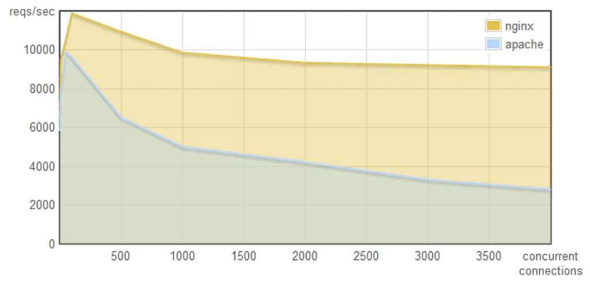
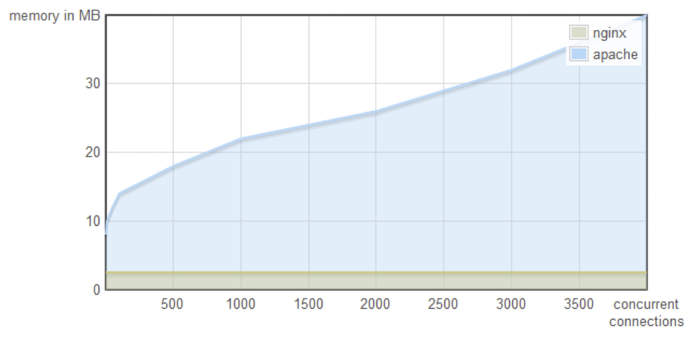

#### Ryan Dahl Original Node presentation

Q: How does the creator of Node.js Ryan Dahl define Node.js?
Node.js:

- Server side JavaScript platform
- Built on Google's V8 engine
- Evented non-blocking I/O. Similar to EventMachine and Twisted
- Uses the CommonJS module system
- Is written in 8,000 lines of C/C++, 2,000 lines of JavaScript, with 14 contributors.

Q: Why are we doing I/0 wrong? Why does it need to be done differently?
A: We are thinking about I/O makes things difficult. Doing any sort of application or server makes things difficult because of the way we are implementing I/O.

Q: In many web applications what occurs?
A: You query a database for some result from the database then you use the result. But what is my web application doing while the database request is running?

A: In many cases the application is doing nothing.

Q: So what is a better solution?
A: You want your application to multitask and not have to wait on a request thats speed is dependant on array of variables such as disk speed, latency etc. Thus you want to have other threads of execution that can run while the request is waiting to be fulfilled.

Q: So what was NGINX, and Apache doing right and what are they doing wrong?

**Apache vs NGINX**

Concurrency x Request per Second

_As you can see nginx servers have much better performance req per sec as concurrent connections (clients on the server) increase than apache servers_

Concurrency x Memory

_NGINX's memory is virtually unaffected by the amount of current connections (clients on the server) as compared to apaches memory. NGINX stays with a very stable as clients begin to hit the server and remains with a relatively small footprint_

Q: So what is driving such a performance advantage by NGINX over Apache? What is the difference?
A: Apache uses one thread per connection. While NGINX does not use threads. It uses an event loop.
A: So the event loop is what is driving that performance advantage.

Q: What is a thread?
A: A thread is the mechanism that executes commands to the CPU. In CS a thread of execution is the smallest sequence of programming instructions that can be managed independently by a scheduler, which is typically a part of the operating system.

Q: So what makes JavaScript great for working with a server that can scale well with ever increasing request?
A: JavaScript was designed to specifically be used with the event loop. Think of browser side JavaScript it is an event loop. When I create a button, someone clicks it I get an onclick callback.
